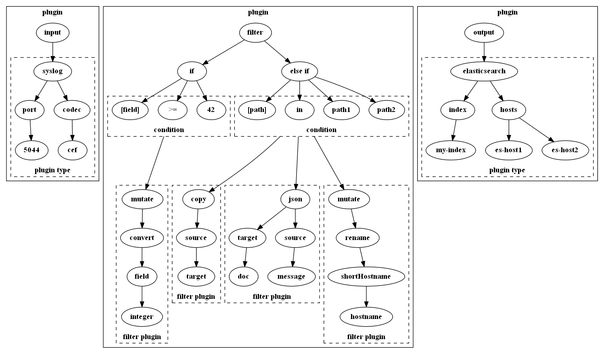

## About The Project

### How Logstash Pipeline Works
> The Logstash event processing pipeline has three stages: inputs → filters → outputs.\
> Inputs generate events, filters modify them, and outputs ship them elsewhere.\
> Inputs and outputs support codecs that enable you to encode or decode the data as it enters or exits the pipeline without having to use a separate filter.

The pipeline configuration file is a custom format developed by the Logstash folks using [Treetop](https://cjheath.github.io/treetop/syntactic_recognition.html).
The grammar itself is described in the source file [grammar.treetop](https://github.com/elastic/logstash/tree/v8.11.1/logstash-core/lib/logstash/config/grammar.treetop) and compiled using Treetop into the custom [grammar.rb](https://github.com/elastic/logstash/blob/v8.11.1/logstash-core/lib/logstash/config/grammar.rb) parser.
That parser is then used to set up the pipeline from the Logstash configuration.

See also:
- [How Logstash Works](https://www.elastic.co/guide/en/logstash/current/pipeline.html)
- [Creating a Logstash pipeline](https://www.elastic.co/guide/en/logstash/current/configuration.html)


## Documentation

The latest documentation is at https://tomaskoutek.github.io/logstash-pipeline-parser/ and contains description of all methods, classes with individual examples and their results. 
Or you can display description directly with the help function.

For example:

```python
from logstash_pipeline_parser import Pipeline

help(Pipeline.parse)
```

## Getting Started



### Installing

Install from [pip](https://pypi.org/project/logstash-pipeline-parser/):

```
pip install logstash-pipeline-parser
```

### Dependencies
- [pyparsing](https://github.com/pyparsing/pyparsing) for creating [PEG](https://en.wikipedia.org/wiki/Parsing_expression_grammar) parser

## Quick Example

For full documentation with examples please see [documentation](https://tomaskoutek.github.io/logstash-pipeline-parser/).

Let's try pipeline with two input plugins: 

```python
from logstash_pipeline_parser import Pipeline

data = r"""
       input {
         beats {
           host => "0.0.0.0"
           port => 5044
           client_inactivity_timeout => 3600
           include_codec_tag => true
           enrich => [source_metadata, ssl_peer_metadata]
           ssl => true
           ssl_key => "/some/path/my.key"
           id => "input_beats"
         }
         
         udp {
           port => 5045
           host => "0.0.0.0"
         }
       }
"""

pipeline = Pipeline(data)
ast = pipeline.parse()
```

will produce [Abstract syntax tree](https://en.wikipedia.org/wiki/Abstract_syntax_tree):

```python
from ipaddress import IPv4Address
from pathlib import Path

[
    ["input", [
        ["beats", [
            ["host", [IPv4Address("0.0.0.0")]], 
            ["port", [5044]], 
            ["client_inactivity_timeout", [3600]], 
            ["include_codec_tag", [True]], 
            ["enrich", [
                ["source_metadata", "ssl_peer_metadata"]
            ]], 
            ["ssl", [True]], 
            ["ssl_key", [Path("/some/path/my.key")]], 
            ["id", ["input_beats"]]
        ]], 
        ["udp", [
            ["port", [5045]], 
            ["host", [IPv4Address("0.0.0.0")]]
        ]]
    ]]
]

```
Of course, it is possible to parse all kinds of plugins, conditions and data types.
You can also search in the pipeline. The searched key can also contain the wildcard `*`, for example **"output.\*.hosts"** will return
(if the pipeline definition contains them):

- `("output.elasticsearch.hosts", [["127.0.0.1:9200","127.0.0.2:9200"]])`
- `("output.logstash.hosts", ["127.0.0.1:9801"])`


```python
results = pipeline.search("input.*.port")

print(list(results))
# [
#   ("input.beats.port", [5044]), 
#   ("input.udp.port", [5045])
# ]
```

The `search` method returns a generator, so we can easily iterate:

```python
for key, value in pipeline.search("*.port"):
    print(f"key: {key}, value: {value[0]}")

# key: input.beats.port, value: 5044
# key: input.udp.sub.port, value: 5045
```

The return value can be any element from the tree (integer, string, field, plugin,...):

```python
results = pipeline.search("input.beats.enrich")

print(list(results))
# [
#   ("input.beats.enrich", [["source_metadata", "ssl_peer_metadata"]])
# ]
```


## License

Distributed under the MIT License. See LICENSE for more information.
